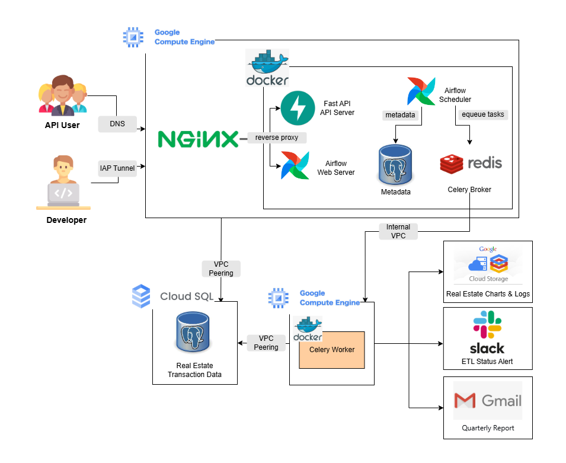

# Airflow Real Estate ETL Project

## System Architecture

## DAG Workflow

Automated quarterly real estate data processing pipeline orchestrated by Airflow, executed sequentially on the 5th day of each quarter:

| Time | DAG | Purpose |
|------|-----|---------|
| 02:00 | `real_estate_etl` | Crawl, clean, and store real estate transaction data |
| 04:00 | `real_estate_here_geocoding` | Convert addresses to coordinates (HERE API) |
| 09:00 | `real_estate_google_geocoding` | Retry failed geocoding with Google API |
| 10:00 | `real_estate_quarterly_report` | Generate visualizations and send email reports |

**Schedule:** Runs on Jan 5, Apr 5, Jul 5, Oct 5 annually
## API Usage

FastAPI server deployed on Control VM  using DNS for lightweight access without additional infrastructure costs.

**Interactive Docs**: https://api.cyc-encode.site/docs

---

### Endpoints

#### 1. Get Total Price & Area (All Types)
**GET** `/housetrade/total_price_and_pin/{city}`

Returns combined records (presale + used) for specified period.

**Request**
```http
GET /housetrade/total_price_and_pin/{city}?area={area}&start_year={yyy}&end_year={yyy}&page={n}&page_size={n}
```

<details>
<summary>Response</summary>
  
```json
{
  "metadata": {
    "city": "台北市",
    "area": "內湖區",
    "start_year": 113,
    "end_year": 113,
    "total_records": 26391,
    "page": 1,
    "page_size": 3,
    "total_pages": 8797
  },
  "data": [
    {
      "total_price": 11354437500,
      "total_pin": 5237.21
    }
  ]
}
```
  
</details>

---

#### 2. Get Used Housing Data
**Request**
```http
GET /housetrade/used/total_price_and_pin/{city}?area={area}&start_year={yyy}&end_year={yyy}&page={n}&page_size={n}
```

Returns used housing records only.


---

#### 3. Get Presale Housing Data
**Request**
```http
GET /housetrade/presale/total_price_and_pin/{city}?area={area}&start_year={yyy}&end_year={yyy}&page={n}&page_size={n}
```

Returns presale housing records only.


---

#### 4. Get Transaction Volume
**GET** `/housetrade/volume/{city}`

Query total transaction counts with grouping options.

**Request**
```http
GET /housetrade/volume/{city}?area={area}&start_year={yyy}&end_year={yyy}&group_by={year|quarter}&building_type={大樓/華廈|公寓|透天厝}
```

<details>
<summary>Response</summary>
  
```json
{
  "metadata": {
    "city": "台北市",
    "area": "內湖區",
    "start_year": 113,
    "end_year": 113,
    "group_by": "year",
    "building_type": "公寓",
    "total_volume": 610
  },
  "data": [
    {
      "year": 113,
      "volume": 610
    }
  ]
}
```
</details>

**Query Parameters**:
- `group_by`: `year` or `quarter`
- `building_type`: `大樓/華夏`, `公寓`, or `透天厝`

---

#### 5. Send Quarterly Report
**POST** `/housetrade/report/send`

Generate and email quarterly real estate reports.

**Request Body**
```json
{
  "recipients": [
    "analyst@company.com",
    "manager@company.com"
  ],
  "season": 4,
  "year": 113
}
```

<details>
<summary>Response</summary>
  
```json
{
  "success": true,
  "message": "成功發送 2/2 封郵件",
  "success_count": 2,
  "failed_recipients": [],
  "year": 113,
  "season": 4
}

```

</details>

## Project Structure
```
real-estate-etl/
├── apis/
│   ├── api_config.py
│   ├── database.py
│   ├── main.py
│   └── schemas.py
├── dags/
│   ├── config/
│   │   ├── __init__.py
│   │   └── settings.py
│   ├── etls/
│   │   ├── __init__.py
│   │   ├── extractors.py
│   │   ├── loaders.py
│   │   └── transformers.py
│   ├── pipelines/
│   │   ├── __init__.py
│   │   ├── google_geocoding.py
│   │   ├── here_geocoding.py
│   │   ├── reporting.py
│   │   └── visualization.py
│   ├── utils/
│   │   ├── __init__.py
│   │   ├── database.py
│   │   ├── helpers.py
│   │   └── logging.py
│   ├── __init__.py
│   ├── real_estate_etl.py
│   ├── real_estate_google_geocoding.py
│   ├── real_estate_here_geocoding.py
│   └── real_estate_report.py
├── deployment/
│   ├── database/
│   │   ├── init/
│   │   │   ├── 01_create_config_tables.sql
│   │   │   └── 02_insert_initial_data.sql
│   │   ├── schemas/
│   │   │   ├── email_recipients.sql
│   │   │   ├── email_sender.sql
│   │   │   ├── real_estate_presale.sql
│   │   │   └── real_estate_used.sql
│   └── USAGE.md
│   ├── docker/
│   │   ├── Dockerfile.control                     
│   │   ├── Dockerfile.worker                    
│   │   ├── stop-services.sh          
│   │   ├── start-services.sh        
│   │   ├── airflow-env.yml                      
│   │   ├── docker-compose.control.yml            
│   │   ├── docker-compose.worker.yml              
│   │   ├── vm-init.sh
│   │   ├── weekly-maintenance.sh                             
│   │   └── README.md               
│   ├── requirements-control.txt
│   └── requirements-worker.txt
├── .gitignore
└── README.md
```
# Airflow Deployment Guide

## Architecture Overview
- **Control VM**: Airflow Scheduler + UI Webserver + API Server
- **Worker VM**: Airflow Celery Worker
- **Sensitive Variables**: GCP Secret Manager
- **Non-Sensitive Variables**: docker compose files

## Prerequisites

### 1. GCP Secret Manager Setup
Setup secrets using GCP Console or gcloud CLI:
- `PG_PASSWORD`: PostgreSQL Password
- `SLACK_WEBHOOK_URL`: Slack Webhook URL
- `HERE_API_KEY`: HERE Maps API Key
- `GMAIL_APP_PASSWORD`: Gmail App Password
- ...
```bash
# example
echo -n "your_password" | gcloud secrets create PG_PASSWORD \
  --data-file=- \
  --project=real-estate-202510
```

### 2. Service Account and IAM Roles

**Service Account:** `airflow-sa@real-estate-202510.iam.gserviceaccount.com`  
Used by both Control VM and Worker VM.

**Project-level IAM Roles:**

| Role | Purpose |
|------|---------|
| `roles/cloudsql.client` | Connect to Cloud SQL instances |
| `roles/secretmanager.secretAccessor` | Read secrets from Secret Manager |
| `roles/storage.objectAdmin` | Read/write GCS logs bucket |
| `roles/logging.logWriter` | Write logs to Cloud Logging |
| `roles/monitoring.metricWriter` | Write metrics to Cloud Monitoring |

### 3. Firewall Rules and VM Tags

**VM Network Tags:**

| VM | Tags |
|-----|------|
| Control VM | `airflow-control`, `http-server`, `api-server` |
| Worker VM | `airflow-worker` |

**Firewall Rules:**

| Rule | Port | Purpose |
|------|------|---------|
| allow-http | 80 | SSL certificate verification |
| allow-https | 443 | Secure API access |
| allow-iap-proxy | 22, 8080 | SSH and Airflow UI via IAP |
| default-allow-internal | all | VPC internal communication |

## Deployment 

See [deployment/docker/README.md](https://github.com/CYCencode/real-estate-etl/blob/main/deployment/docker/README.md) for detailed instructions.

## Troubleshooting

#### Check if environment variables are loaded correctly
#### [Check Service status](https://github.com/CYCencode/real-estate-etl/blob/main/deployment/docker/README.md#step-5-verify-services)
#### Other : permission issue
```bash
# VM Service Account
gcloud compute instances describe INSTANCE_NAME --format="get(serviceAccounts[0].email)"

# Secret IAM access
gcloud secrets get-iam-policy PG_PASSWORD
```

## Security Notes

### Network Security
- **HTTPS Encryption**: API endpoints secured with Let's Encrypt SSL/TLS certificates
- **Rate Limiting**: nginx configured with 10 requests/second per IP to prevent abuse
- **Firewall Rules**: Only necessary ports exposed (80/443 for HTTPS, 8080 for Airflow UI)
- **VPC Isolation**: Control and Worker VMs in same VPC for secure internal communication
- **Private IP Communication**: Inter-VM traffic uses internal IPs (Redis, PostgreSQL)

### Access Control
- **Least Privilege Principle**: Custom service account with minimal required roles:
  - `roles/cloudsql.client` - Cloud SQL access
  - `roles/secretmanager.secretAccessor` - Secret retrieval only
  - `roles/storage.objectAdmin` - GCS logs bucket access
  - `roles/logging.logWriter` - Stackdriver logging
- **Non-Root Execution**: Services run as `airflow` user (UID 50000) in containers
- **No Root SSH**: VM operations use `airflow` user; sudo only when necessary

### Secret Management
- **Centralized Secrets**: All credentials in GCP Secret Manager, never in code/git
- **Runtime Injection**: Secrets loaded via `vm-init.sh` at startup, not persisted in env files
- **Secret Rotation**: Update secrets in Secret Manager without redeploying VMs

### Container Security
- **Isolated Services**: Each component in separate Docker container
- **Read-Only Volumes**: DAG code mounted read-only in containers
- **Resource Limits**: CPU/memory limits prevent resource exhaustion
